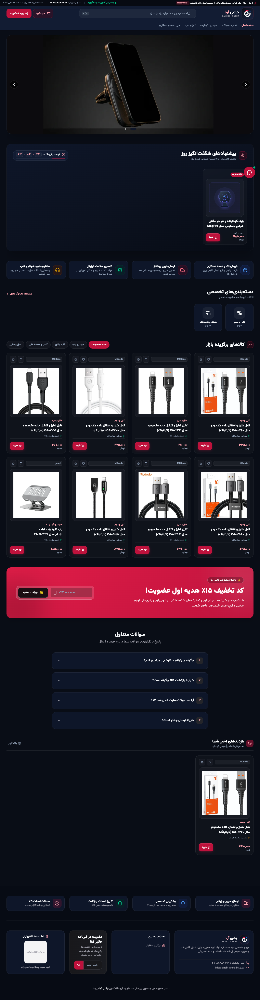
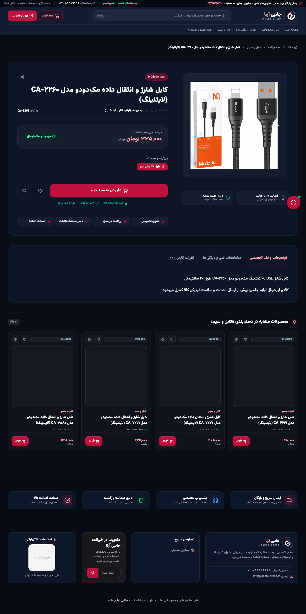
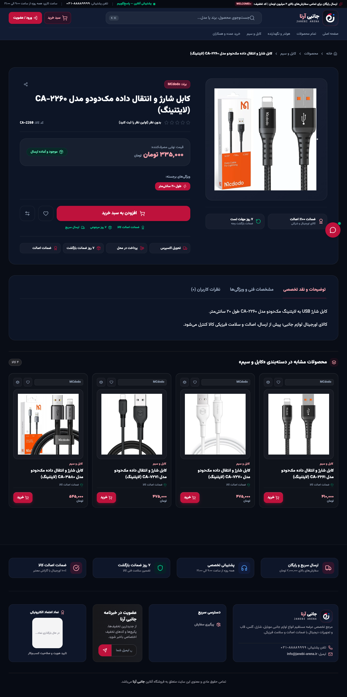
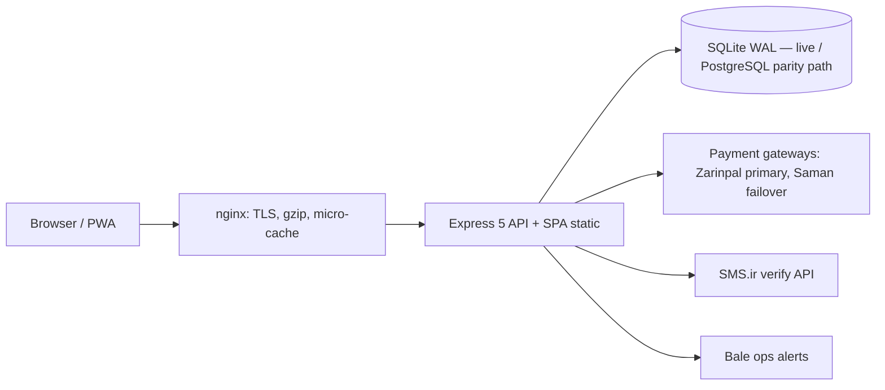

# JanebiArena — جانبی آرنا
## Production E-Commerce Platform (Persian / RTL)

[](https://github.com/MrRooobooot/Janebi-Store/actions/workflows/ci.yml)
[](https://github.com/MrRooobooot/Janebi-Store/actions/workflows/secret-scan.yml)

A full-stack e-commerce system for a mobile-accessories store: React 19 storefront + admin
panel, Express 5 API, Drizzle ORM (SQLite/WAL serving the live deployment; PostgreSQL 15
supported via the same schema + parity suite), nginx + Docker Compose on a single VPS.

**Live in production: [janebiarena.ir](https://janebiarena.ir)** — last verified 2026-10-03:
site HTTP 200, `/api/health` reports `database: ok`, catalog serves 45 products.

## Screenshots (live production, captured 2026-10-03)

| Home (light) | Product page (light) | Product page (dark) |
|---|---|---|
|  |  |  |

## Overview

- **Storefront** — RTL Persian UI (Vazirmatn), light/dark themes, full Persian digit
  normalization in forms, catalog with instant filtering (category / brand / price / stock),
  multi-step cart & checkout, coupons, wishlist/compare, order history, reviews.
- **Admin panel** — dashboard stats, product/order/coupon/user management, safe cascade
  deletes, order status workflow (`pending_payment → processing → shipped → delivered / cancelled`).
- **Payments** — Iranian gateway integration with automatic failover (see below).
- **Ops tooling** — deploy/release scripts, backups with restore verification, health
  monitors, nginx drift guard, live security probes (see `scripts/ops/`).

The codebase is ~580 commits of production iteration; this README describes the current
verified state. Deeper documents: [`docs/ARCHITECTURE.md`](docs/ARCHITECTURE.md) ·
[`docs/PORTFOLIO_CASE_STUDY.md`](docs/PORTFOLIO_CASE_STUDY.md).

## Architecture



- **Frontend**: React 19 + TypeScript, Vite 8, Tailwind v4, React Router v7, Motion.
- **Backend**: Node 22 + Express 5 (TypeScript), Zod validation, Drizzle ORM, pino-http logging.
- **Service worker** (`public/sw.js`): precache + versioned static/API caches.
- **Deploy**: rsync + Docker Compose; nginx terminates TLS (Let's Encrypt) and reverse-proxies
  to the app container. Full detail and diagrams in [`docs/ARCHITECTURE.md`](docs/ARCHITECTURE.md).

## Core Engineering Problems

These are the real problems this codebase solves — each is documented with
problem/detection/root-cause/solution/verification in
[`docs/PORTFOLIO_CASE_STUDY.md`](docs/PORTFOLIO_CASE_STUDY.md).

1. **Payment handoff & gateway environment mismatch** — gateway StartPay rejected some
   sessions based on HTTP Referer; handoff is now server-side (`/pay/:authority`), and the
   CI test derives the expected gateway host from `ZARINPAL_SANDBOX` instead of hardcoding
   production (this fixed 5 consecutive red CI runs).
2. **Stale-deploy ambiguity** — "is production actually running the new build?" is answered
   by a hash-sealed release identity generated at build time
   (`scripts/ops/release-info.mjs`, `BUILD_INFO`) instead of guessing from behavior.
3. **Atomic inventory / anti-overselling** — stock changes are guarded in DB transactions
   and concurrency tests hammer the flash-sale paths.
4. **Search migration** — catalog search runs on SQLite FTS5 with an automatic LIKE
   fallback for environments without FTS.
5. **Database hot-path indexing** — index migrations (`0005_order_created_at_indexes`,
   `0013_hot_path_indexes`) added for the queries the app actually runs hot.
6. **PWA service-worker bug** — a clone-after-consumed body error flooded production
   consoles; fixed with cache version bump + a probe script (`scripts/audit/sw-reviews-probe.mjs`).
7. **Security hardening rounds** — CSP report-host poisoning via `X-Forwarded-Host` (fixed
   by pinning the report endpoint to configured `APP_URL`), rate-limit bypass via forged
   `X-Forwarded-For` (fixed by rewriting the header at the proxy boundary), robots/header
   consistency, static-exposure gate, and full-history secret scanning (gitleaks CI).
8. **OTP SMS timing incident** — a 2-minute OTP TTL expired before Iranian carriers
   delivered the SMS; TTL raised to 5 minutes with the incident recorded in code comments.

## Payment Infrastructure

- **Provider adapters** (`server/services/payment/`): Zarinpal (primary) and Saman (failover)
  behind `PaymentFailoverRouter` with circuit-breaker behavior.
- **Server-side handoff**: the client never talks to the gateway directly; the server renders
  the start-pay form at `/pay/:authority` with the correct Referer, which fixed an
  intermittent gateway rejection (diagnosed with a live matrix probe
  `scripts/ops/zarinpal-startpay-probe.py`; measurement matrix recorded in the handoff test;
  runbook `docs/live-payment-runbook.md`).
- **Environment switch**: `ZARINPAL_SANDBOX=true|false` selects the gateway host; tests are
  environment-aware so CI (sandbox) and production (live) both assert correct behavior.
- **Order state machine**: orders move through explicit statuses; callbacks verify authority
  + amount before marking paid; pending payments are auto-cancelled by a reaper query
  (backed by the `orders(status, created_at)` index).
- **Cash on delivery** is supported for eligible addresses.

## Inventory Integrity

- Stock is decremented inside a transaction with a conditional guard
  (`UPDATE ... WHERE stockQuantity >= qty`), so concurrent checkouts cannot oversell.
- Cancellation/return paths restore stock with parity to the checkout path.
- `tests/concurrency/` contains stress tests for the money-critical paths (parallel
  checkouts, flash-sale, cancel race). Seed/demo data only — no fabricated ratings or
  review counts are shipped (the catalog starts with zero review aggregates).

## Search

- `/api/products?search=` uses SQLite **FTS5** when available, with a **LIKE fallback** so
  behavior degrades gracefully (e.g. older SQLite builds).
- Search result pages are `noindex,follow` (both header and robots predicate served from one
  shared function — a header-only fix once left the body contradicting the header).

## Security

- **Auth**: bcrypt password hashing; httpOnly cookie sessions with refresh-token rotation
  (`tokenVersion` revocation); OTP login flow (see limitations — SMS provider currently not
  configured in production, the endpoint fails closed with `503`).
- **Rate limiting**: express-rate-limit per sensitive route; client IP is taken from the
  proxy chain with `X-Forwarded-For` rewritten at the boundary (a forgeable XFF once allowed
  rate-limit bypass; fixed and covered by tests).
- **Headers**: Helmet CSP with `report-to` endpoint pinned to configured `APP_URL`
  (never request headers — the old `X-Forwarded-Host` trust both forged the header and
  poisoned nginx's 15 s response cache for other visitors).
- **Input**: Zod schemas on every mutating endpoint; multer with type/size limits on uploads.
- **RBAC**: all admin endpoints require role checks and return 403 by default.
- **Process**: static-exposure gate (SEC-01) + CSP inline-hash probe (SEC-03) in
  `verify-all.sh`, and a **gitleaks full-history CI workflow** (`.github/workflows/secret-scan.yml`,
  config `.gitleaks.toml`).

## Reliability & Operations

- **Health**: `/api/health` (used by monitors and deploy gate).
- **Releases**: `scripts/ops/release.sh` ships hash-sealed releases with rollback;
  build metadata stamped by `release-info.mjs`.
- **Backups**: `scripts/ops/backup-db.mjs` + `backup-verify.sh` — daily cron produces the
  DB dump, verifies it by **actually restoring** (`integrity_check`, `foreign_key_check`,
  row reads), keeps a 7-day rotation, and uploads a copy off-box with a Bale alert.
- **Monitoring**: `scripts/ops/vps-monitor.py` watches nginx errors, health, disk, and
  container restarts every 5 minutes, alerting via Bale; a disk-exhaustion drill was
  performed (ops log in `docs/`).
- **Drift guard**: `scripts/ops/nginx-drift.sh` diffs the deployed nginx config against the
  versioned copy in `deploy/`.

## Testing & Verification

- **534 tests in 68 files** (Vitest + Supertest), including concurrency stress tests and a
  PostgreSQL parity suite (`tests/postgres/postgres-verification.test.ts`, enabled when
  `PG_DATABASE_URL` is set; skipped by default — 5 skipped).
- **Local gate**: `npm run verify` → typecheck (`tsc --noEmit`), full Vitest run, production
  build, live rate-limit proof (`scripts/gate/ratelimit-live.mjs`), SEC-01 static-exposure
  probe, SEC-03 CSP inline-hash probe.
- **CI**: GitHub Actions runs typecheck + tests + build + gates; suite is green
  (run [37064784849](https://github.com/MrRooobooot/Janebi-Store/actions/runs/37064784849)).
- **E2E**: Playwright suite (`playwright.e2e.config.ts`), run separately via
  `npm run test:e2e` — the verify gate deliberately does not include e2e.
- Live probes: `scripts/gate/ratelimit-live.mjs`, payment and search probes under
  `scripts/` (read-only, safe against production).

## Production Deployment

Ubuntu 24.04 VPS → Docker Compose (`app` + `postgres:15`) → nginx (TLS via Let's Encrypt,
gzip, micro-cache with stale-while-revalidate for catalog endpoints) → Node.

```bash
# Deploy (from dev machine; server host comes from local, gitignored deploy.env)
cp .env.example .env            # first time only
VPS_HOST=<your-server> ./deploy.sh
```

`deploy.sh` builds, stamps release metadata, syncs `dist/` + migrations, restarts the app
container, and health-checks the result. No server IPs or credentials live in this repo;
operational values come from `deploy.env` (gitignored) or the server's `.env`.

## Performance Work

- nginx **micro-cache (15 s) + stale-while-revalidate** on catalog API responses, so bursts
  of traffic hit the cache, not the DB.
- Immutable long-lived caching for hashed build assets; WebP product images; gzip.
- **bfcache fix**: HTML responses send `no-cache` instead of `no-store`, restoring
  back/forward-cache for real users (verified with a probe).
- Hot-path DB indexes added based on actual query patterns (see case study).

## Failure Investigations

Short list; full write-ups in [`docs/PORTFOLIO_CASE_STUDY.md`](docs/PORTFOLIO_CASE_STUDY.md):

- **"Payment fails sometimes"** → root-caused to gateway Referer gating; fixed by moving the
  handoff server-side. Diagnosed with a live 9-cell matrix probe against the real gateway.
- **"Old version still visible after deploy"** → release identity now hash-sealed and
  observable; deploy gate checks it.
- **"Console errors from service worker on the product page"** → clone-after-consumed bug in
  the SW fetch path; cache version bump + probe.
- **"CI red for 5 consecutive pushes"** → sandbox vs production gateway host mismatch in a
  test's hardcoded URL; fixed environment-aware (not by weakening assertions).

## Lessons Learned

1. **Verify against the real environment** — a sandbox/production host difference cost five
   red CI runs; environment-dependent assertions must derive from the environment.
2. **Make release identity observable** — "it looks right" is not "it is the new build".
   Hash-sealed metadata removes the ambiguity at deploy time and forever after.
3. **Money paths need DB-level guards** — application-level checks alone cannot survive
   concurrency; conditional updates + tests can.
4. **Infrastructure drifts silently** — keep nginx config versioned and diffed, and treat
   every hosted config as code.
5. **A leaked credential is forever until rotated** — scrubbing the public surface is step
   one; rotation is the fix (tracked as an owner action, not solved by deletion).

## Technology Stack

| Layer | Tech |
|---|---|
| Frontend | React 19, TypeScript, Vite 8, Tailwind v4, React Router 7, Motion, Lucide |
| Backend | Node 22, Express 5, Zod, Drizzle ORM, bcrypt, jsonwebtoken, pino-http, Helmet |
| Database | SQLite better-sqlite3 (WAL) — serving the live deployment; PostgreSQL 15 parity path |
| Payments | Zarinpal (primary), Saman (failover), circuit breaker, COD |
| Infra | Docker Compose, nginx, Let's Encrypt, Ubuntu 24.04 |
| Quality | Vitest 4, Supertest, Playwright, gitleaks, custom security gates |
| Ops | release.sh, backup-verify.sh, vps-monitor.py, nginx-drift.sh, Bale alerts |

## Repository Structure

```text
server/            Express API — routes, services, middleware, db (Drizzle), validators
src/               React storefront + admin panel (pages, components, contexts, hooks)
tests/             Vitest suites — api/, concurrency/, postgres/, unit/
scripts/           ops/ (deploy, backup, monitoring) · gate/ (live security probes) · audit/
deploy/            Versioned nginx config for the production host
drizzle/           Migrations (sqlite/ + pg/)
docs/              Architecture, case study, runbooks, audits, screenshots/
public/            Static assets, service worker, llms.txt / llms-full.txt (regenerate: npm run gen:llms)
```

## Current Status

- **Production**: live at [janebiarena.ir](https://janebiarena.ir) (verified 2026-10-03).
- **CI**: green — tests, typecheck, build, secret scan.
- **Catalog**: 45 SKUs live; the public AI-facing docs (`llms.txt`, `llms-full.txt`) are
  generated from the live API by `npm run gen:llms` and were last regenerated 2026-10-03.

## Known Limitations

- **OTP login requires SMS provider configuration** which is not currently enabled in
  production: `/api/auth/otp/send` returns a clean `503` ("سرویس پیامکی فعال نیست") and
  password login remains the supported path. The flow itself (rate-limit per phone, 5-min
  TTL, 5-attempt lockout, auto-registration) is fully implemented and dev-tested.
- **Single-VPS deployment** — no HA/redundancy; recovery relies on verified backups and
  runbooks, not failover infrastructure.
- **PostgreSQL parity tests** require `PG_DATABASE_URL` (e.g. the compose `postgres`
  service); the default local/CI run exercises the SQLite dialect and skips them (5 skipped).
- **Small live catalog** (2 categories, 45 SKUs at last sync) — llms files and sitemap are
  regenerated from live data, so they track the store as it grows.

## License

MIT — see [LICENSE](LICENSE).

Maintainer: Aidin Nemati ([@MrRooobooot](https://github.com/MrRooobooot))
