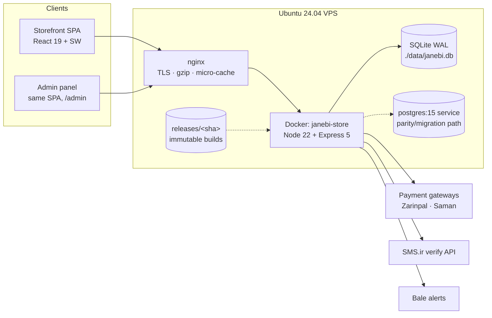
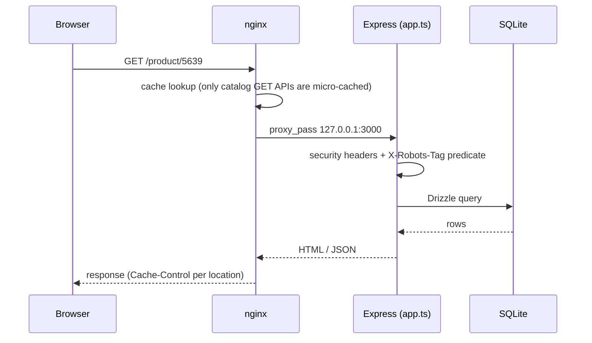
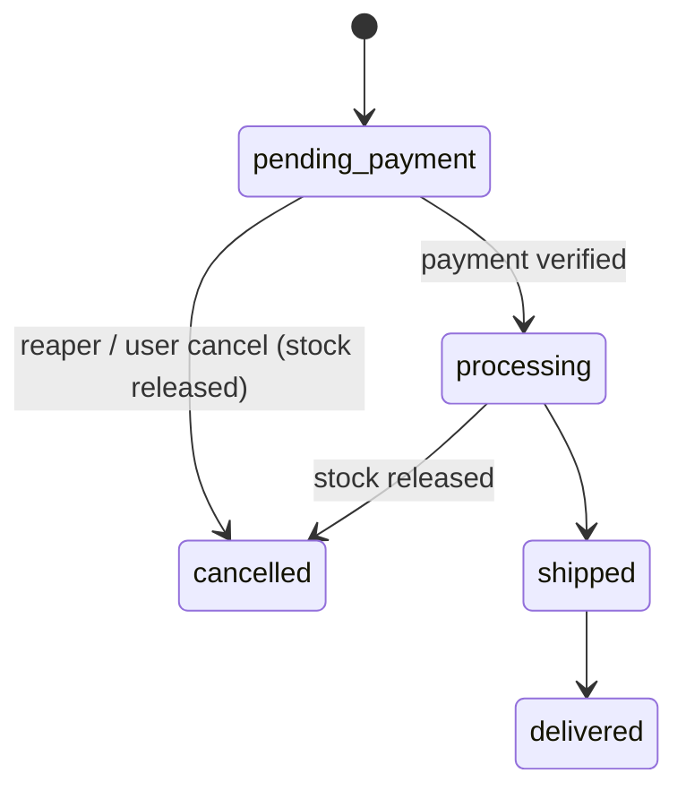
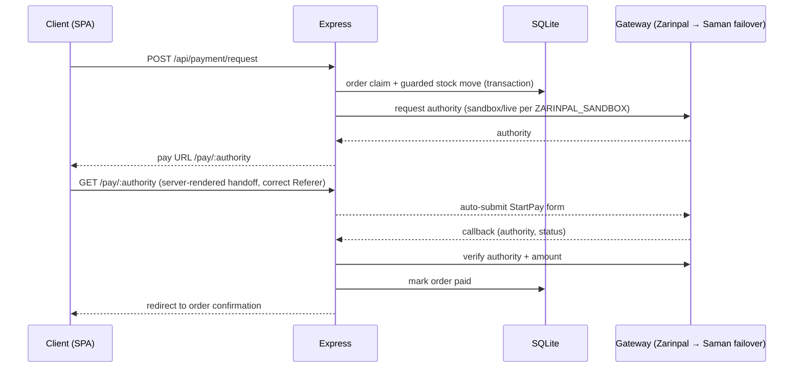
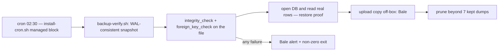

# Architecture — JanebiArena

> Describes the **actual, verified implementation** (state checked 2026-10-03). Every element
> maps to code in this repository; file paths are given for each part. Nothing here is
> aspirational — where a capability does not exist (e.g. HA failover), it is listed under
> Limitations instead.

## 1. System Context



Facts backing this diagram:

- docker-compose sets `DATABASE_URL=./data/janebi.db` for the app container
  (`docker-compose.yml`) — the live deployment serves from SQLite (WAL). The
  `postgres:15` service is shipped and monitored (`scripts/ops/vps-monitor.py` checks
  both containers); the PostgreSQL dialect is exercised by the parity suite
  (`tests/postgres/`).
- nginx runs on the host and reverse-proxies to `127.0.0.1:3000`
  (`deploy/nginx-janebi-store.conf`).

## 2. Request Lifecycle



Middleware order in `server/app.ts` is security-first: `trust proxy = 1`, then a wrapper
that sets `Permissions-Policy` and the CSP `Reporting-Endpoints` header (derived from
`env.APP_URL`, **never** request headers — see case study #10), then the robots predicate
(`shouldNoIndex`, one function feeding both the header and the body), then routes.

Caching policy (`deploy/nginx-janebi-store.conf`):

| Content | Policy |
|---|---|
| Catalog GET APIs | nginx `proxy_cache` 15 s, `stale-while-revalidate=120`, bypass on client `Cache-Control` |
| Hashed build assets | `max-age=31536000, immutable` |
| Other static (images, fonts) | `max-age=3600` |
| HTML documents | `no-cache, must-revalidate` (comment in conf: "no-store blocked bfcache") |
| Authenticated APIs | `no-store` (default in app, `server/app.ts`) |

## 3. Frontend

- React 19 + TypeScript SPA built by Vite into `dist/` (React Router 7; Tailwind v4;
  Motion; Lucide). RTL Persian UI with Vazirmatn; shared Persian digit/date utilities in
  `src/lib/`.
- Global state via contexts: Auth, Cart, Wishlist, Compare, Theme (`src/contexts/`).
  Modals render through a portal root to escape sticky headers.
- **Service worker** (`public/sw.js`): versioned caches
  (`janebi-static-v1.2.3`, `janebi-api-v1.2.1`), an explicit precache list, and
  stale-while-revalidate logic that is version-gated and probe-covered
  (`scripts/audit/sw-cache-probe.mjs`, `scripts/audit/sw-reviews-probe.mjs`).
  Commented invariants in the file document the clone-before-read fix (case study #9).

## 4. Backend Layers

```text
server/
├── index.ts        entry: HTTP bootstrap, SPA fallback, DB init
├── app.ts          Express app: middleware chain, route mounting
├── routes/         products, auth, cart, orders, payment, admin, reviews, blog,
│                   sitemap, upload, csp-report, …
├── services/       payment/ (adapters + failover router), sms
├── middleware/     auth (JWT cookies), admin RBAC, error handling, rate limiters
├── validators/     Zod schemas per endpoint
├── db/             Drizzle schema + dual-dialect client (better-sqlite3 / pg)
└── data/           seeds & fixtures (demo data only)
```

- **Validation**: every mutating route parses with Zod before touching anything.
- **Auth**: JWT access + refresh in httpOnly cookies; refresh rotation with `tokenVersion`
  revocation; bcrypt password hashing; `requireAuth`/admin middleware; 403-by-default.
- **Errors**: centralized error handler; pino-http request logging.
- **Rate limiting**: `express-rate-limit` per sensitive route group; the client IP comes
  from the proxy chain where nginx **overwrites** `X-Forwarded-For` with
  `$remote_addr` (`deploy/nginx-janebi-store.conf:57`) so forged XFF cannot bypass limits.

## 5. Database

- One Drizzle schema, two dialects. Migrations: `drizzle/sqlite/`, `drizzle/pg/`.
- Catalog search: `products_fts` (SQLite FTS5 virtual table) — prefix-match per token,
  with input sanitized so user text can never inject FTS operators; automatic LIKE
  fallback when FTS5 is unavailable (`server/routes/products.ts`, `fts5Available`).
- Indexing (migrations `0005_order_created_at_indexes`, `0013_hot_path_indexes`):
  orders(user_id), orders(created_at), orders(status, created_at) [pending-payment
  reaper], order_items(order_id), reviews(product_id), cart_items/user, wishlist/address
  user indexes, products(category), products(brand), products(price).

## 6. Orders & Inventory



- Stock moves are transactional and guarded (`WHERE stockQuantity >= qty`); the
  concurrency suite (`tests/concurrency/inventory-race.test.ts`,
  `adversarial-stress.test.ts`) drives parallel checkouts against the same SKUs.
- Cancellation restores stock with parity to the checkout path.

## 7. Payments



- Adapters under `server/services/payment/` (Zarinpal primary; Saman failover;
  `PaymentFailoverRouter` with circuit-breaker behavior). COD is supported.
- The server-side handoff exists because the gateway gates StartPay on HTTP Referer —
  diagnosed with a live matrix probe (`scripts/ops/zarinpal-startpay-probe.py`;
  measurements recorded in `tests/api/pay-handoff.test.ts`).

## 8. Release Pipeline (hash-sealed)

```mermaid
flowchart LR
    B[npm run build] --> S[postbuild: release-info.mjs<br/>BUILD_INFO + RELEASE_MANIFEST.sha256]
    S --> P[release.sh preconditions<br/>BUILD_INFO.release == HEAD, manifest self-check]
    P --> R[immutable releases/<sha>/ on server]
    R --> V[remote verify + RELEASE_SEAL]
    V --> M[additive migration inside running container]
    M --> W[atomic symlink switch ./dist → releases/<sha>/dist]
    W --> H[live verification: identity, 3-way server.cjs hash, DB cols, /api/health]
    H -->|fail| RB[rollback tree: releases/prev-<sha>-dist]
```



`release.sh` refuses a tree whose `BUILD_INFO.release` ≠ HEAD ("stale build"), never
overwrites a shipped release dir, and keeps the previous tree for rollback. Dev-machine
fallback deploy: `deploy.sh` (rsync + compose) reading `VPS_HOST` from gitignored
`deploy.env`. See case study #2/#3.

## 9. Backup System



The cron wrapper on the host execs the repo script so the logic is versioned. "A silent
backup death is impossible" — failures alert the operator. See case study #8.

## 10. Monitoring & Drift

- `scripts/ops/vps-monitor.py` (cron every 5 min) checks: app health (DB-backed `/api/health`),
  container liveness + **RestartCount delta**, root-disk threshold, nginx 5xx rate (last
  5 min), backup freshness (`MAX_AGE_H`), fatal log patterns. Alert state machine: alert on
  start-of-failure, bounded re-reminders, single "recovered" message. Bale delivery is
  plain-text (Bale 500s formatted payloads).
- `scripts/ops/install-cron.sh` — idempotent cron installer; the host can never drift from
  the repo again (see case study #7).
- `scripts/ops/nginx-drift.sh` — diffs the deployed nginx config against `deploy/`.
- `scripts/ops/api-stats.mjs` — API stat snapshots for ops reviews.

## 11. Security Gates

| Gate | What it proves | Where |
|---|---|---|
| `tsc --noEmit` | type safety | `verify-all.sh` step 1 |
| Vitest (534 tests) | behavior incl. concurrency | `verify-all.sh` step 2 (+ skip warning: "a green gate with skips is NOT full coverage") |
| `vite build` + esbuild | production build | step 3 |
| `ratelimit-live.mjs` | limiters actually engage (Vitest can't see them: they skip under NODE_ENV=test) | step 4 |
| `static-exposure.sh` (SEC-01) | `/server.cjs` etc. return 404 publicly | step 5 |
| `csp-inline.sh` (SEC-03) | no `unsafe-inline`, security.txt present | step 6 |
| gitleaks full history | no secrets in any commit reachable from `main` | CI `secret-scan.yml` |
| `test-gate-guards.sh` | the gates themselves fail when they should | `scripts/gate/` |

## 12. Limitations (by design)

- Single VPS: no HA. nginx `use_stale` softens restarts; rollback + verified backups are
  the recovery story.
- OTP login fails closed (503) while the SMS provider is not configured in production.
- PostgreSQL runs as the migration/parity path; the live deployment currently uses SQLite
  (see §1). The parity suite needs `PG_DATABASE_URL` to run.
