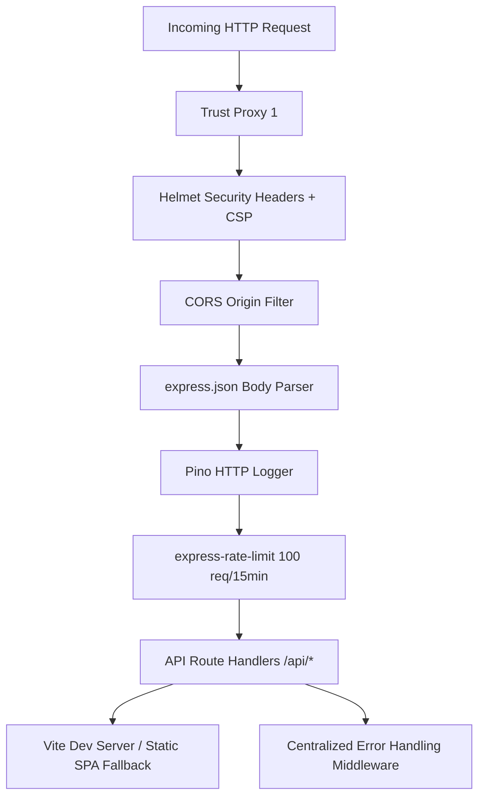

# Architecture Baseline — Janebi-Store

## 1. System Overview
**Janebi-Store** is a specialized Iranian e-commerce web application for mobile and electronics accessories.

## 2. Technology Stack
- **Frontend Framework:** React 19.0.1 + Vite 8.2.0
- **Routing:** React Router v7 (`react-router-dom` 7.18.2)
- **Styling:** Tailwind CSS v4 (`@tailwindcss/vite` 4.1.14) + Lucide React + Motion (`motion` 12.43.0)
- **Backend Runtime:** Node.js (ES Module & CommonJS dual build via `esbuild` / `tsx`)
- **Backend Framework:** Express 5.2.1
- **Database / ORM:** Drizzle ORM 0.45.2
- **Database Engine (Baseline):** SQLite (`data/janebi.db`) / Migration Target: PostgreSQL (`pg` 8.23.0)
- **Authentication:** JWT (`jsonwebtoken` 9.0.3) with Access & Refresh tokens, Passwords hashed via `bcrypt` 6.0.0, SMS OTP subsystem
- **Validation:** Zod 4.4.3 (`server/validators/index.ts`)
- **Security Middleware:** Helmet 8.3.0, CORS 2.8.6, Express Rate Limit 8.6.2
- **Logging:** Pino HTTP (`pino-http` 11.0.0) + `pino-pretty` 13.1.3
- **Payment Gateway:** Zarinpal integration (Sandbox & Production endpoints supported)
- **Testing Framework:** Vitest 4.1.10 + Supertest 7.2.2

## 3. Directory Layout
```text
Janebi-Store/
├── .agents/                   # Audit reports, verification traces, agent logs
├── data/                      # Local SQLite database files & seed data
├── dist/                      # Production client bundle & compiled server.cjs
├── docs/                      # Production architecture & baseline documentation
├── drizzle/                   # Drizzle migration files and SQL snapshots
├── server/                    # Backend API Express application
│   ├── data/                  # Seed dataset (products, categories, users, coupons)
│   ├── db/                    # Drizzle connection initialization & schema definition
│   ├── middleware/            # Auth, validation, error handler, rate limiters
│   ├── routes/                # Route handlers (admin, auth, cart, orders, products, etc.)
│   ├── services/              # Auxiliary services (e.g. Gemini AI, sms, storage)
│   ├── validators/            # Zod validation schemas
│   ├── app.ts                 # Express application middleware pipeline
│   ├── env.ts                 # Environment variable validation with Zod
│   └── index.ts               # Server entrypoint (HTTP listen & Vite integration)
├── src/                       # Frontend React application
│   ├── components/            # UI components, layout, modals, navigation
│   │   ├── admin/             # Admin layouts and table management components
│   │   ├── auth/              # AuthModal & login/register helpers
│   │   ├── cart/              # Cart item list, summaries, free shipping bar
│   │   ├── checkout/          # Checkout steps, address selectors, summary cards
│   │   ├── products/          # Filters, grid, cards, sort headers
│   │   └── profile/           # Profile tabs (info, addresses, order history, VIP)
│   ├── contexts/              # React Contexts (Auth, Cart, Wishlist, Compare, Theme, Toast)
│   ├── hooks/                 # Custom React hooks (useCartSummary, useCheckoutForm, etc.)
│   ├── lib/                   # Utility helpers, constants, recently viewed manager
│   ├── pages/                 # Route page components (Home, Products, Detail, Cart, etc.)
│   │   ├── admin/             # Admin panel pages (Dashboard, Products, Orders, Users, Coupons)
│   │   └── static/            # Static content pages (About, Contact, FAQ, Terms, Privacy)
│   ├── types/                 # TypeScript interfaces & domain types
│   ├── App.tsx                # Master routing definition
│   └── main.tsx               # Client DOM entrypoint
├── tests/                     # Automated test suites
│   ├── api/                   # Integration tests for all REST endpoints
│   ├── concurrency/           # Concurrency race condition & stress tests
│   └── unit/                  # Unit tests for validators, utils, and rollbacks
├── Dockerfile                 # Multi-stage container definition
├── docker-compose.yml         # Container orchestration
├── drizzle.config.ts          # Drizzle kit configuration
├── package.json               # NPM scripts and dependency manifest
├── tsconfig.json              # TypeScript compiler configuration
└── vite.config.ts             # Vite bundler configuration
```

## 4. Middleware Pipeline


## 5. Build and Execution Pipeline
1. **Development Mode:** `npm run dev` executes `tsx server/index.ts`. In non-production, Vite dev server middleware is mounted inside Express for HMR.
2. **Production Build:** `npm run build` runs `vite build` to output client assets to `dist/client`, and `esbuild server/index.ts` to output `dist/server.cjs`.
3. **Production Run:** `npm start` executes `node dist/server.cjs` serving static assets from `dist/client` and API routes under `/api`.
