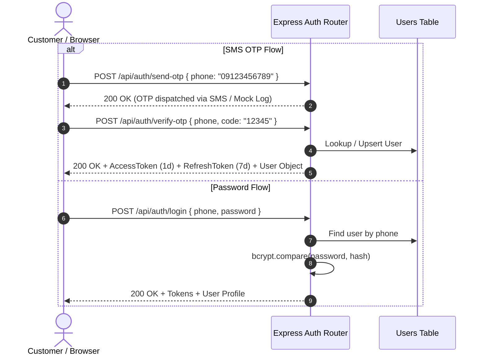

# Authentication Baseline — Janebi-Store

## 1. Authentication Architecture

The application currently supports a hybrid authentication model:
1. **Password Authentication (Legacy / Compatibility):** Standard registration with phone and password, hashed via bcrypt with 10 salt rounds.
2. **SMS OTP Authentication (Primary Production Target):** 5-digit verification code sent to the customer's Iranian mobile number, valid for 2 minutes.

---

## 2. Token Specification & Security
- **Access Token:**
  - Algorithm: `HS256`
  - Signed with: `env.JWT_ACCESS_SECRET`
  - Payload: `{ userId: string }`
  - Lifespan: `1d` (Target in Plan v2: `15m`)
- **Refresh Token:**
  - Algorithm: `HS256`
  - Signed with: `env.JWT_REFRESH_SECRET`
  - Payload: `{ userId: string }`
  - Lifespan: `7d`
  - Rotation Endpoint: `POST /api/auth/refresh`

---

## 3. Authorization & Role-Based Access Control (RBAC)
- **Middleware:** `server/middleware/auth.ts`
- **Functions:**
  - `authenticate`: Extracts `Bearer <token>` from the `Authorization` header, verifies validity against `JWT_ACCESS_SECRET`, queries database for existing user record, and attaches `req.user` to `AuthRequest`.
  - `requireAdmin`: Checks `req.user.role === 'admin'`. Returns `403 Forbidden` if role does not match.

---

## 4. Frontend State & Token Storage
- **Context:** `src/contexts/AuthContext.tsx`
- **Storage Strategy:**
  - Access token stored in `localStorage.getItem('token')`
  - User profile cached in `localStorage.getItem('user')`
  - On app mount, calls `GET /api/auth/me` to refresh user data and addresses from server.
- **Admin Routing Guard:** `src/components/admin/AdminLayout.tsx` checks `user?.role === 'admin'`.

---

## 5. Security Vulnerabilities Identified in Baseline
1. **Access Token Expiration:** Currently set to 1 day; Plan v2 specifies shortening to 15 minutes with automated silent refresh.
2. **Refresh Session Revocation:** No server-side session table currently exists to instantly revoke compromised refresh tokens.
3. **Role Checks:** Direct `role === 'admin'` check instead of granular permission gates (`requirePermission("PRODUCT_CREATE")`).
