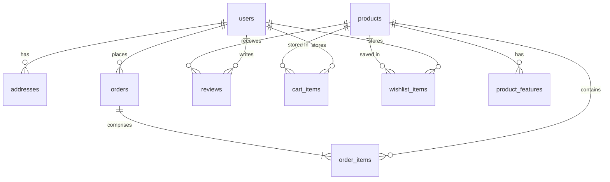

# Database Baseline — Janebi-Store

## 1. Relational Schema Structure

---

## 2. Table Specifications

### 2.1 Table: `users`
- `id` (text / primary key): Identifier (e.g. `usr-1740000000000` or `usr-admin-seed`)
- `name` (text, not null): User's full display name
- `phone` (text, not null, unique): Iranian 11-digit mobile number (`09xxxxxxxxx`)
- `email` (text, nullable): Optional email address
- `password` (text, not null): Bcrypt hashed password string
- `avatar` (text, nullable): Avatar image identifier or URL
- `joinedDate` (text, nullable): Shamsi formatted registration date string (e.g. `۱۴۰۴/۱۱/۳۰`)
- `vipPoints` (integer, default `0`): Loyalty program points
- `role` (text, default `'user'`): Authorization role (`user` | `admin`)

### 2.2 Table: `addresses`
- `id` (text / primary key): Address identifier (e.g. `addr-1740000000000`)
- `userId` (text, not null, FK → `users.id`): Owner reference
- `title` (text, not null): Label (e.g. "خانه", "محل کار")
- `name` (text, not null): Recipient full name
- `phone` (text, not null): Recipient contact phone
- `province` (text, not null): Province name (e.g. "تهران")
- `city` (text, not null): City name
- `address` (text, not null): Detailed street address
- `postalCode` (text, nullable): 10-digit postal code
- `isDefault` (boolean, default `false`): Primary address indicator

### 2.3 Table: `products`
- `id` (serial / integer primary key): Unique numeric ID
- `title` (text, not null): Persian product title
- `category` (text, not null): Category key (e.g. `powerbank`, `cable`, `charger`, `case`, `audio`, `holder`)
- `price` (integer, not null): Final selling price in Tomans
- `originalPrice` (integer, nullable): Price before discount
- `discount` (integer, default `0`): Percentage discount (0–100)
- `image` (text, not null): Main product image URL
- `brand` (text, not null): Brand name (e.g. "Anker", "Baseus", "Samsung", "Apple")
- `warranty` (text, nullable): Guarantee details (e.g. "گارانتی ۱۸ ماهه شرکتی")
- `description` (text, nullable): Detailed HTML/text specifications
- `rating` (real, default `0.0`): Aggregated average rating (1.0–5.0)
- `reviewsCount` (integer, default `0`): Number of approved customer reviews
- `stockQuantity` (integer, default `10`, not null): Available inventory in warehouse
- `sku` (text, unique, nullable): Stock keeping unit identifier

### 2.4 Table: `product_features`
- `id` (serial / integer primary key): Feature row ID
- `productId` (integer, not null, FK → `products.id`): Product reference
- `feature` (text, not null): Bullet feature text string

### 2.5 Table: `orders`
- `id` (text / primary key): Order number (e.g. `ORD-1740000000000`)
- `userId` (text, nullable, FK → `users.id`): Registered customer ID (null for guest)
- `date` (text, not null): Shamsi formatted creation date
- `status` (text, not null): Enum code (`pending_payment` | `processing` | `shipped` | `delivered` | `cancelled`)
- `statusText` (text, not null): Persian label for UI
- `total` (integer, not null): Final paid amount in Tomans
- `subtotal` (integer, not null): Items subtotal before discounts/shipping
- `shippingFee` (integer, default `0`): Shipping cost in Tomans
- `discountAmount` (integer, default `0`): Applied coupon discount amount
- `paymentMethod` (text, not null): `online` | `cod`
- `shippingMethod` (text, not null): `express` | `standard`
- `recipientName` (text, not null): Receiver name
- `recipientPhone` (text, not null): Receiver phone
- `recipientAddress` (text, not null): Full postal delivery address
- `recipientPostalCode` (text, nullable): 10-digit postal code
- `authority` (text, nullable): Zarinpal payment authority token
- `refId` (text, nullable): Zarinpal bank transaction tracking reference

### 2.6 Table: `order_items`
- `id` (serial / integer primary key): Line item ID
- `orderId` (text, not null, FK → `orders.id`): Parent order reference
- `productId` (integer, not null, FK → `products.id`): Purchased product
- `price` (integer, not null): Unit price at purchase time in Tomans
- `qty` (integer, not null): Quantity purchased
- `title` (text, not null): Product title snapshot
- `image` (text, not null): Product image snapshot
- `brand` (text, not null): Product brand snapshot

### 2.7 Table: `reviews`
- `id` (text / primary key): Review ID (e.g. `rev-1740000000000`)
- `productId` (integer, not null, FK → `products.id`): Reviewed product
- `userId` (text, nullable, FK → `users.id`): Author user ID
- `userName` (text, not null): Display author name
- `rating` (integer, not null): Score 1 to 5
- `title` (text, not null): Review headline
- `comment` (text, not null): Review body text
- `date` (text, not null): Shamsi review date
- `isVerifiedBuyer` (boolean, default `false`): Verified purchase badge
- `recommend` (boolean, default `false`): Would recommend product
- `helpfulCount` (integer, default `0`): Upvotes
- `unhelpfulCount` (integer, default `0`): Downvotes

### 2.8 Table: `coupons`
- `code` (text / primary key): Coupon uppercase code (e.g. `OFF50`, `WELCOME15`)
- `percent` (integer, nullable): Percentage discount (1–100)
- `amount` (integer, nullable): Fixed discount amount in Tomans
- `minTotal` (integer, not null): Minimum cart subtotal required
- `label` (text, not null): Description banner
- `active` (boolean, default `true`): Coupon active status

### 2.9 Table: `cart_items`
- `id` (text / primary key): Unique row ID (`cart-userId-productId`)
- `userId` (text, not null, FK → `users.id`): User reference
- `productId` (integer, not null, FK → `products.id`): Product reference
- `quantity` (integer, not null, default `1`): Quantity in cart
- `addedAt` (integer, not null): Epoch timestamp

### 2.10 Table: `wishlist_items`
- `id` (text / primary key): Unique row ID (`fav-userId-productId`)
- `userId` (text, not null, FK → `users.id`): User reference
- `productId` (integer, not null, FK → `products.id`): Product reference
- `addedAt` (integer, not null): Epoch timestamp

---

## 3. Seed Dataset
The baseline seed file (`server/data/seed.ts`) populates:
- 1 Admin user (`09123456789`, password hashed with bcrypt, role `admin`)
- 1 Demo customer (`09120000000`, role `user`) with saved addresses
- 12 comprehensive initial accessory products across 6 categories with features and initial inventory
- 3 discount coupons (`WELCOME15`, `OFF50`, `NOWRUZ1404`)
