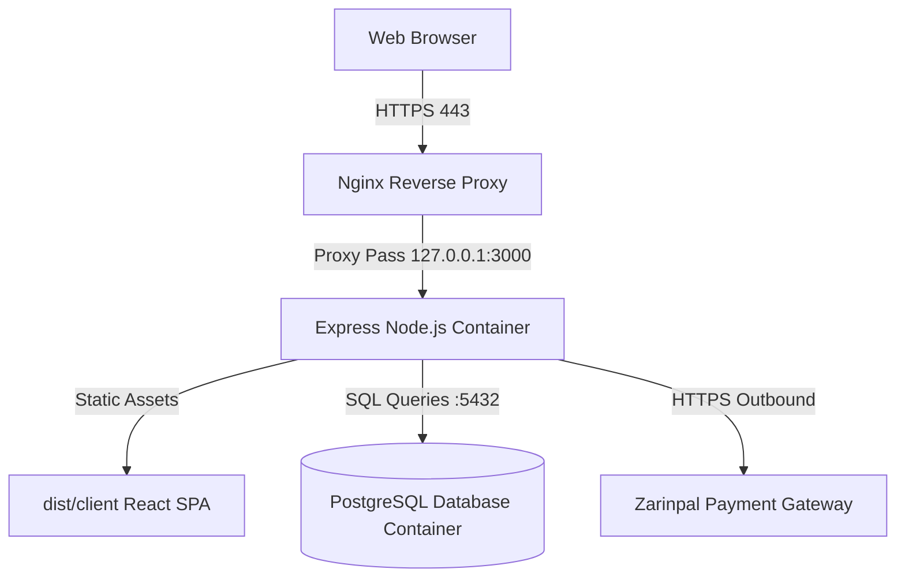

# Deployment Baseline — Janebi-Store

## 1. Production Runtime Architecture

---

## 2. Docker Configuration

### 2.1 `Dockerfile`
- Multi-stage build for production efficiency:
  - **Stage 1 (Builder):** Installs all dev dependencies, runs `vite build` and `esbuild server/index.ts` to output `dist/server.cjs` and `dist/client`.
  - **Stage 2 (Runner):** Lightweight Alpine Node.js image with non-root user, copies built `dist/` directory, and starts with `node dist/server.cjs`.

### 2.2 `docker-compose.yml`
- Orchestrates two core services:
  - `app`: Node.js Express server on port 3000.
  - `db`: PostgreSQL 15 container on port 5432 with health check (`pg_isready`).

---

## 3. Environment Configuration (`server/env.ts`)

Environment variables are strictly validated at server startup with Zod:

| Variable | Type | Description |
| :--- | :--- | :--- |
| `PORT` | `number` (default `3000`) | Server listening port |
| `NODE_ENV` | `'development' \| 'production'` | Runtime environment |
| `DATABASE_URL` | `string` | PostgreSQL connection URI |
| `JWT_ACCESS_SECRET` | `string (min 10 chars)` | Secret for signing short-lived access JWTs |
| `JWT_REFRESH_SECRET` | `string (min 10 chars)` | Secret for signing refresh JWTs |
| `ZARINPAL_MERCHANT_ID`| `string` | Merchant UUID from Zarinpal |
| `ZARINPAL_SANDBOX` | `boolean` (default `true`) | Toggles sandbox vs live payment gateway |
| `APP_URL` | `string` (default `http://localhost:3000`) | Base public URL for CORS and payment callbacks |
| `GEMINI_API_KEY` | `string (optional)` | Optional API key for AI assistant features |

---

## 4. Reverse Proxy & SSL (Nginx)
In production on the Ubuntu VPS (`45.82.137.67` / `janebiarena.ir`):
- Nginx terminates SSL/TLS.
- Proxies requests matching `/api/` and page routes to `http://127.0.0.1:3000`.
- Passes standard proxy headers (`X-Forwarded-For`, `X-Forwarded-Proto`, `X-Real-IP`).
- Express trusts reverse proxy via `app.set('trust proxy', 1)`.
