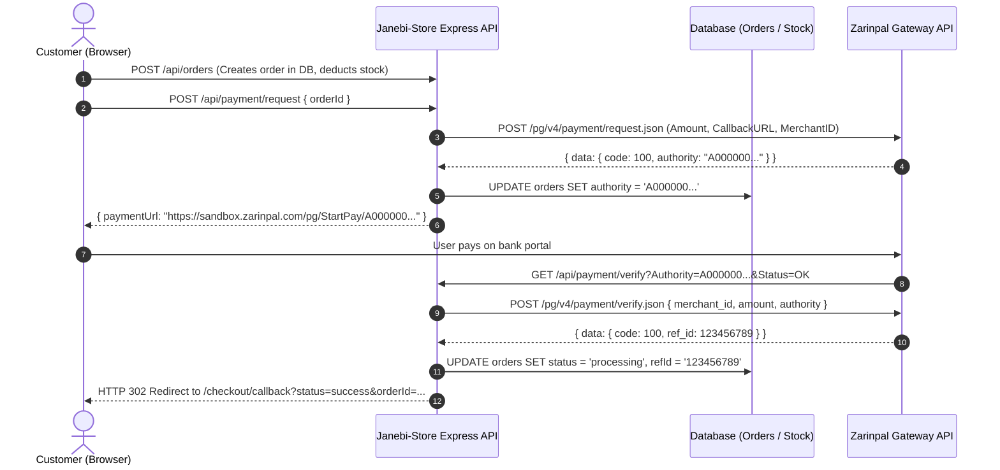

# Payment Baseline — Janebi-Store

## 1. Payment Lifecycle Architecture

The payment system integrates with the Iranian **Zarinpal** payment gateway (with Sandbox and Production support).

---

## 2. Gateway Configuration & Endpoints
- **Environment Flags:**
  - `ZARINPAL_MERCHANT_ID`: Merchant code provided by Zarinpal
  - `ZARINPAL_SANDBOX`: Boolean flag (`true` | `false`)
- **Endpoints:**
  - **Sandbox:** `https://sandbox.zarinpal.com/pg/v4/payment/`
  - **Live Production:** `https://payment.zarinpal.com/pg/v4/payment/`
  - **Redirect URL:** `https://(sandbox.)zarinpal.com/pg/StartPay/{Authority}`

---

## 3. Order Status State Machine
- `pending_payment`: Order created, stock deducted, awaiting customer payment.
- `processing`: Payment verified successfully with bank reference code (`refId`).
- `shipped`: Admin has packaged and dispatched order with tracking code.
- `delivered`: Customer received package.
- `cancelled`: Payment cancelled/failed, or manually aborted; stock restored to inventory.

---

## 4. Failure & Rollback Handling
When `GET /api/payment/verify` receives `Status=NOK` or verification fails:
1. Locates order by `authority`.
2. Queries all line items (`order_items`).
3. Executes a transactional update restoring product inventory (`stockQuantity = stockQuantity + item.qty`).
4. Sets `orders.status = 'cancelled'`.
5. Redirects customer to `/checkout/callback?status=failed&orderId=...`.

---

## 5. Architectural Debt in Payment Baseline
1. **Independent Payment Table:** Payment records currently live inside `orders` table (fields `authority`, `refId`, `paymentMethod`) instead of a separate `payments` table.
2. **Reconciliation Job:** Missing an automated cron/job to query stale `pending_payment` orders and cancel them after 30 minutes, releasing inventory reservations.
3. **Idempotency:** Need explicit idempotency checks on double webhook/callback triggers.
